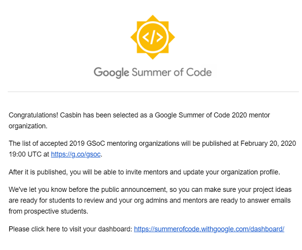

# Google Summer Of Code 2020 for Casbin

## What is Google Summer Of Code?

Google Summer of Code (GSoC) is a global program held by Google to bring students into open source software development. Students work with an open source organization on a 3 month programming project during their break from school. See more details at: https://summerofcode.withgoogle.com/

## Congratulations!

Casbin has been selected as a Google Summer of Code 2020 mentor organization for the first year!

We still don't know how many slots we will get yet. But students are already free-to-go to make contact with Casbin people and do some code-level contributions to Casbin projects to let the community know you more.

## For students:

The student will be more likely selected if he/she:

1. Contribute to Casbin related project before.
2. Familiar with the techniques required by the idea he selected.
3. Show the previous code related to the idea on personal website or GitHub.
4. Provide a personal website and descriptions for previous work/projects.
5. Provide demo sites for the previous projects if possible.
6. Provide a resume/CV.

## Ideas

- [Casbin for C/C++](#casbin-for-cc)
- [Casbin Core Engine](#casbin-core-engine)
- [Casbin.js](#casbinjs)
- [Casbin Dashboard](#casbin-dashboard)
- [Node-Casbin](#node-casbin)
- [A PHP extension for Casbin, implemented by C/C ++](#a-php-extension-for-casbin-implemented-by-cc-)
- [Casbin for Rust](#casbin-for-rust)

### Casbin for C/C++

#### Description

Port Golang Casbin into C/C++. We call it `casbin-cpp`. It should work on all primary OSs, like Windows, Linux, macOS. Most of Casbin's functionalities (for example 90%) should work. 

On Windows, it should build on Visual Studio. On Linux, gcc should work. About the test cases, I think maybe Google-Test is a good choice.

The current progress is: https://github.com/casbin/casbin-cpp

#### Requirements

1. C/C++
2. Golang (only need to read code)

### Casbin Core Engine

#### Description

Extend the Casbin model/policy grammar to support more features in Casbin core engine. This will first be done in Golang Casbin. Possibly applied to other language implementations.

Some issues to work on:

1. support pattern function in 3rd args of g: https://github.com/casbin/casbin/issues/337
2. Resolve policy conflicts: https://github.com/casbin/casbin/issues/338
3. Scaling ABAC Rules: https://github.com/casbin/casbin/issues/354
4. Explain enforcement by informing matched rules: https://github.com/casbin/casbin/issues/355
5. Make GetImplicitPermissionsForUser Deep: https://github.com/casbin/casbin/issues/357

#### Requirements

1. Golang
2. Other languages that Casbin is written with

#### Mentor

[Yang Luo](https://github.com/hsluoyz), Casbin founder

### Casbin.js

Quite a lot of users want to use Casbin to control web frontend UI elements, like:

1. Some tabs are only visible to admin users.
2. Some buttons should be grayed-out for users with no permission to click them.
3. A list can only show filtered items based on a user's permission rights.

Currently, Node-Casbin already supports to run in browser. But the API like `enforce()` is still not friendly to frontend developers to control the visibility of a button. So we need:

1. A frontend developer friendly API for authorization based on Casbin, e.g., `isVisible(button_id)`
2. A mechanism to load model and policy data from backend. Of course we assume the backend also uses a Casbin implementation.

The current progress is: https://github.com/casbin/casbin.js

#### Requirements

1. Javascript
2. Node-Casbin
3. At least one backend language like Golang

#### Mentor

[Caleb Faruki](https://github.com/calebfaruki), Casbin member

### Casbin Dashboard

#### Description

Build a web UI dashboard/admin portal for Casbin & Casbin-Server. It can:

1. Manage models, adapters, enforcers. The adapter manager should handle different DBs.
2. Model editor with a syntax and semantic validator.
3. Policy editor, it should be able to handle 10,000+ more rules.
4. A test page to make example request to Casbin and get response, like Postman. So users can test their model and policy.
5. Authentication and authorization for the dashboard itself. Of course authorization will be implemented in Casbin (we proudly dogfood our own product :))

The current progress is: https://dashboard.casbin.org/. Source code: https://github.com/casbin/casbin-dashboard. We want the student to continue the work.

#### Requirements

1. Golang (backend)
2. Javascript + React + Ant Design (frontend)
3. Casbin

#### Mentor

[Yang Luo](https://github.com/hsluoyz), Casbin founder

### Node-Casbin

#### Ideas

1. Adapters(https://casbin.org/docs/en/adapters)

**Idea**

- Implement PostgreSQL adapter
- Implement MySQL adapter
- Implement SQL Server adapter

**Difficulty**

Easy

2. RBAC links

**Idea**

We plan to build RBAC incrementally when the policy changes.

**Difficulty**

Medium-Hard

#### Requirements

1. Node.js
2. TypeScript

#### Mentor

[Yang Luo](https://github.com/hsluoyz), Casbin founder

### A PHP extension for Casbin, implemented by C/C ++.

#### Description

We now have a version implemented by PHP language: [PHP-Casbin](https://github.com/php-casbin/php-casbin), but we prefer to make a PHP extension through C/C ++ to improve performance.
It needs to implement the full functionality of Casbin.

#### Requirements

1. C/C++
2. PHP
3. Casbin

#### Mentor

[techoner](https://github.com/techoner)

### Casbin for Rust

#### Ideas

1. [Tokio](https://github.com/tokio-rs/tokio) async/await runtime and fully asynchronous adapter

**Idea**

- Make async-std runtime (the current one) a feature `runtime-async-std` and enables it by default.
- Implement the new feature `runtime-tokio` which use tokio as the executor of async/await.
- Implement a fully asynchronous adapter: sqlx-adapter using [sqlx](https://github.com/launchbadge/sqlx).

**Difficulty**

Easy

2. Actix actor and actix-web middleware using **RBAC with domain**

**Idea**

- Implement an actix actor which accepts messages of rbac request (subject, domain, object, action). The actor will return the result of enforcing.
- Implement an actix-web middleware which reads JWT token from HTTP authorization header (To make it simple, JWT token = \<username\>.\<domain\>)
  and sends rbac request (subject, domain, object, action) to actix actor for authorization. The middleware wll block the request if actix actor denied the request.

**Difficulty**

Medium hard

3. Redis TTL cache

- Design **Cache** trait, make **CachedEnforcer** being able to accept external cache.
- Implement redis TTL cache.

**Difficulty**

Easy

4. Logger system using env_logger

- Design **Logger** trait and implement the default logger which implements **Logger** trait.
- Logger can show if the enforcing result is cached or not by the prefix **[Cache]**.
- Logger support levels (info, debug, error...). Logs can be filtered by specific Level.
- Logs are by default colorful.

**Difficulty**

Easy medium

#### Mentor

[Cheng JIANG](https://github.com/GopherJ), casbin member

### Casbin for .net core

**Idea**

1. Adapter

- Implement Entity Framework Core Adapter;

2. Restful API

- Implement Restful API in ASP.NET Core MVC

3. Implement IWatcher interface;

#### Requirements

1. C#
2. .net core
